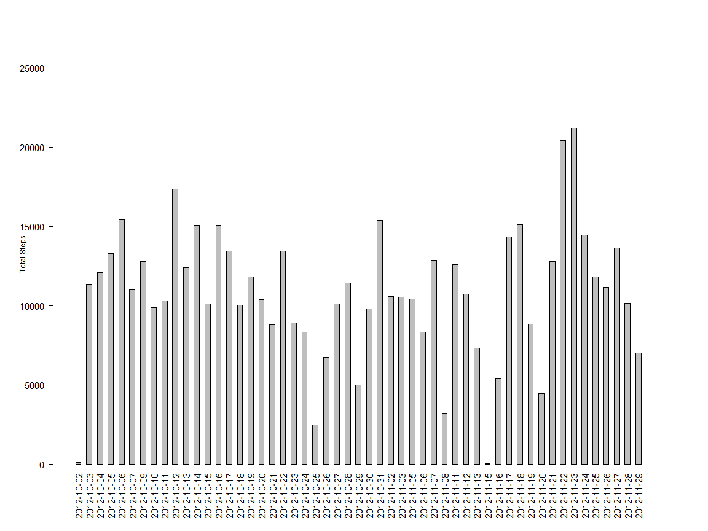
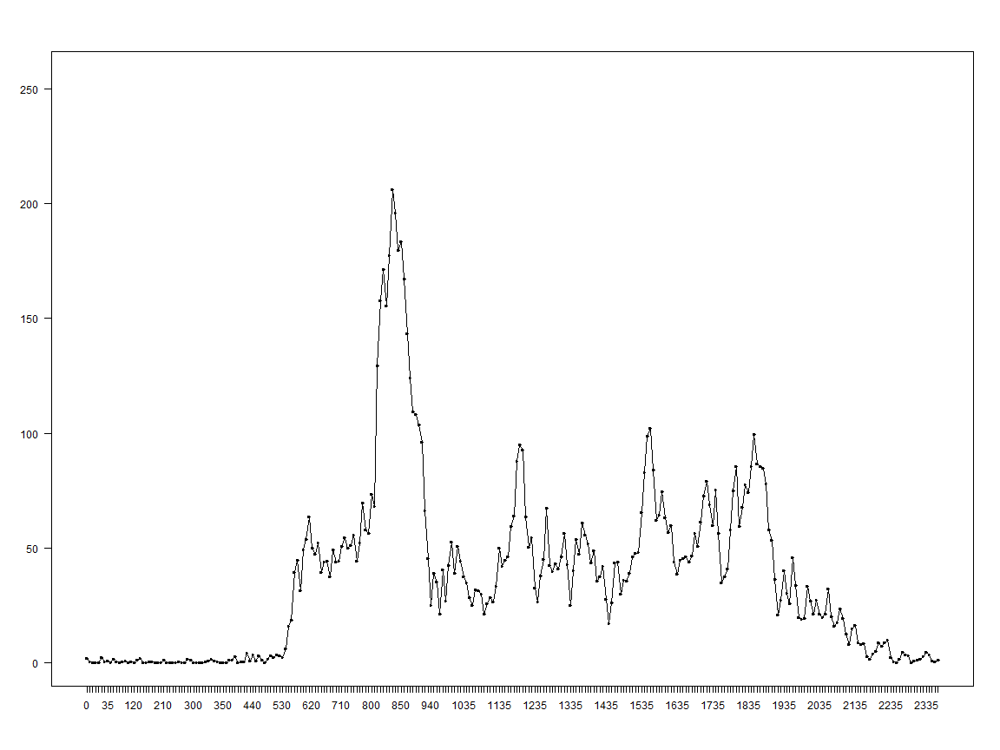

## Loading and preprocessing the data

#### In the following lines we load the data from supplied activity.csv file into a data frame named activity. It is assumed that the program is being executed from the same directory where the activity.csv file is located


```r
activity <- read.csv("activity.csv",header=TRUE)
```

```
## Warning in file(file, "rt"): cannot open file 'activity.csv': No such file
## or directory
```

```
## Error in file(file, "rt"): cannot open the connection
```

## What is mean total number of steps taken per day?

#### In the following lines, the aggregate function has been used to calculate the total number of steps taken by date and the output has been stored in totalstepsbydate variable

```r
totalstepsbydate <- aggregate(steps~date,activity,FUN=sum)
```

#### In the following lines, a bar plot is constructed showing the total number of steps walked per day. For helpful visual representation, the plot area is set to 16:9 aspect ratio, appropriate margins have been left, x-axis labels have been made perpendicular to axis and y-axis limit has been kept at 25% above the maximum possible value


```r
par(mai=c(1.5,1.2,1,1), las=2)
barplot(totalstepsbydate$steps, 
        cex.axis=1.25, cex.names=1.25, space=1,
        names.arg=totalstepsbydate$date,
        ylab="Total Steps",
        xlab="", 
        ylim=c(0,1.25*max(totalstepsbydate$steps))
        )
```

 

#### Following code calculates and reports the mean and median of total number of steps taken per day


```r
mean(totalstepsbydate$steps)
```

```
## [1] 10766.19
```

```r
median(totalstepsbydate$steps)
```

```
## [1] 10765
```

## What is the average daily activity pattern?

#### In the following code, first the data frame is transformed so as to convert the interval values into factors, and then average number of steps taken across days for that specific interval has been calculated


```r
activity <- transform(activity,interval = as.factor(interval))
avgstepsbyinterval <- aggregate(steps~interval,activity,FUN=mean)
```

#### Following code generates a line plot of the number of steps by interval averaged across all days


```r
par(las=1)
plot(avgstepsbyinterval$interval,avgstepsbyinterval$steps,
     ylim=c(0,50+max(avgstepsbyinterval$steps)),
     )
lines(avgstepsbyinterval$interval,avgstepsbyinterval$steps,type="l",lty=1,lwd=1)
```

 
#### Following code prints the 5-minute interval which, on average across all days, contains the maximum number of steps


```r
print(avgstepsbyinterval[which(avgstepsbyinterval$steps==max(avgstepsbyinterval$steps)),],row.names=FALSE)
```

```
##  interval    steps
##       835 206.1698
```

## Imputing missing values

#### Following code calculates and prints the number of rows in the data having missing values


```r
print((nrow(activity) - sum(complete.cases(activity))),row.names=FALSE)
```

```
## [1] 2304
```

#### Following code creates a new data frame from activity and then replaces missing values for steps with the mean value for that 5-second interval calculated accross days


```r
activity2 <- activity
for (i in 1:nrow(activity2)){
    if(is.na(activity2[i,1])){
        interval <- activity2[i,3]    
        replacement <- avgstepsbyinterval[which(avgstepsbyinterval$interval
                                                ==interval),2]      
        activity2[i,1] <- replacement
    }
}
```

#### Next part of the code repeats the generation bar plot of total number of steps taken per day; this time with the missing values filled in. In the new plot, there are no missing dates. 

#### By comparing previous graph with this, one can easily identify dates like 2012-10-01, 2012-10-08, 2012-11-01, 2012-11-04, 2012-11-09, 2012-11-10, 2012-11-14, 2012-11-30 - which are missing in first plot but populated in second one


```r
totalstepsbydate2 <- aggregate(steps~date,activity2,FUN=sum)
par(mai=c(1.5,1.2,1,1), las=2)
barplot(totalstepsbydate2$steps, 
        cex.axis=1.25, cex.names=1.25, space=1,
        names.arg=totalstepsbydate2$date,
        ylab="Total Steps",
        xlab="", 
        ylim=c(0,1.25*max(totalstepsbydate2$steps))
        )
```

 
#### Following code calculates mean and median steps per day. As can be seen, the mean value has remained unchanged whereas the median has increased and is equal to the mean now


```r
mean(totalstepsbydate2$steps)
```

```
## [1] 10766.19
```

```r
median(totalstepsbydate2$steps)
```

```
## [1] 10766.19
```

## Are there differences in activity patterns between weekdays and weekends?

#### In the next part of the code, we first transform the data set having all values populated to add a column marking the day of week that the date corresponds to. We then farther transform to make this column identify the date as just weekday or weekend. We make one final transformation to factorize the values of the newly created column


```r
activity3 <- transform(activity3, weekday = weekdays(as.Date(date)))

for (i in 1:nrow(activity3)){
    if(activity3[i,4] %in% c('Saturday','Sunday')){
        activity3[i,4] <- 'weekend'
    } else {
        activity3[i,4] <- 'weekday'
    }
}

activity3 <- transform(activity3, weekday = factor(weekday))
```

#### Next we subset the data based on the weekday and weekend distinction made above. Then we calculate the average no. of steps by interval


```r
weekdayactivity <- activity3[which(activity3$weekday=='weekday'),]
weekendactivity <- activity3[which(activity3$weekday=='weekend'),]

avgstepsbyintervalweekday <- aggregate(steps~interval,weekdayactivity,FUN=mean)
avgstepsbyintervalweekend <- aggregate(steps~interval,weekendactivity,FUN=mean)
```

#### Now we create a panel plot to compare the two average trends computed above. The output suggests that average number of steps taken per time interval during the weekends are considerable higher than those during weekdays


```r
par(mfrow=c(2,1),las=1)
plot(avgstepsbyintervalweekend$interval,
     avgstepsbyintervalweekend$steps,
     ylim=c(0,50+max(avgstepsbyintervalweekend$steps)),
     main="weekend")
lines(avgstepsbyintervalweekend$interval,
      avgstepsbyintervalweekend$steps,
      type="l",lty=1,lwd=1)
plot(avgstepsbyintervalweekday$interval,
     avgstepsbyintervalweekday$steps,
     ylim=c(0,50+max(avgstepsbyintervalweekday$steps)),
     main="weekday")
lines(avgstepsbyintervalweekday$interval,
      avgstepsbyintervalweekday$steps,
      type="l",lty=1,lwd=1)
```

 
